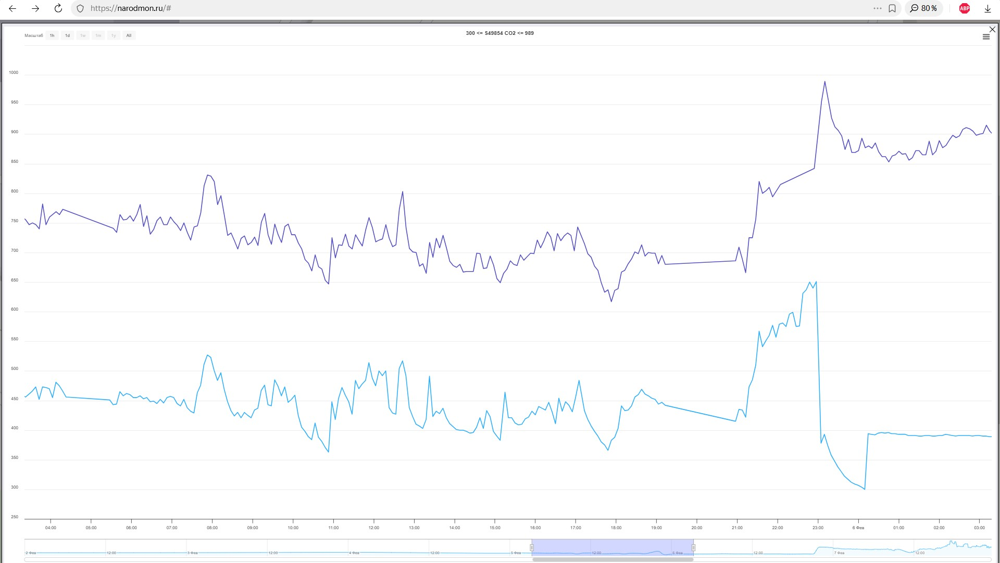
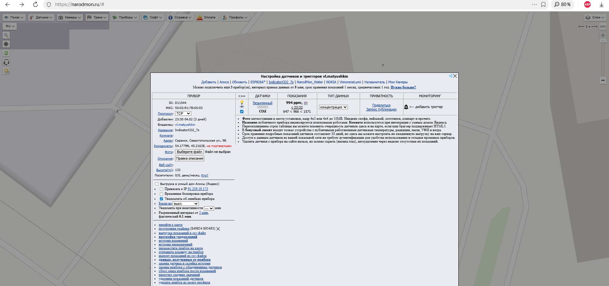

<!DOCTYPE html>
<html lang="ru">
<head>

<h1>Передача данных в сервис «Народный мониторинг»</h1>

   
   

  Прибор может передавать данные о концентрации CO₂ в сервис
  <a href="https://narodmon.ru/#" target="_blank">«Народный мониторинг»</a>.

<h2>1. Включение Wi-Fi на индикаторе</h2>

<ol>
  <li>Отключите питание прибора.</li>
  <li>Зажмите кнопку на задней стенке прибора.</li>
  <li>Не отпуская кнопку, подайте питание.</li>
  <li>Индикатор включится и моргнёт подсветкой <strong>3 раза</strong>.</li>
</ol>

  С телефона подключитесь к Wi-Fi точке доступа
  <strong>Vimoreno Lumi</strong>.  
  Окно авторизации должно открыться автоматически.

  В открывшемся окне необходимо ввести:

<ul>
  <li><strong>SSID</strong> — имя вашей домашней Wi-Fi сети</li>
  <li><strong>Пароль</strong> от Wi-Fi</li>
</ul>

  После ввода данных нажмите кнопку <strong>Submit</strong>.

  Если нажать <strong>Exit</strong>, режим настройки завершится без сохранения данных.

  <strong>Важно:</strong> Wi-Fi сеть должна быть в диапазоне <strong>2.4 ГГц</strong>.

  <strong>Важно:</strong> После включения прибора данные Wi-Fi необходимо ввести
  <strong>в течение 3-х минут</strong>.

<h2>2. Работа прибора после настройки Wi-Fi</h2>

  После выхода из режима настройки индикатор выполнит калибровку стрелки
  и начнёт передавать показания концентрации CO₂
  <strong>1 раз в 5 минут</strong>.

  <strong>Примечание:</strong> 
  Wi-Fi можно отключить. Для этого зайдите в режим настройки,
  введите любой SSID и пароль длиной менее 8 символов
  и нажмите кнопку <strong>Submit</strong>.

  <strong>Примечание 2:</strong> 
  Статус Wi-Fi можно определить по плате внутри корпуса:
  <ul>
    <li>Синий светодиод горит — Wi-Fi включён</li>
    <li>Синий светодиод не горит — Wi-Fi отключён</li>
  </ul>
   Светодиод показывает статус первые 5 минут после включения. Потом гаснет, что бы не засвечивать фон ночью:

<h2>3. Регистрация в сервисе «Народный мониторинг»</h2>

  Перейдите на сайт
  <a href="https://narodmon.ru/#" target="_blank">https://narodmon.ru</a>
  и зарегистрируйтесь.

  Также можно авторизоваться через <strong>Яндекс</strong>.

  Для добавления устройства необходимо, чтобы индикатор
  <strong>хотя бы один раз</strong> передал данные на сервер.
  После включения Wi-Fi подождите примерно <strong>7 минут</strong>.

<h2>4. Получение MAC-адреса устройства</h2>

<ol>
  <li>
    На главном экране сервиса нажмите
    <strong>Профиль → Журнал отладки моего IP</strong> 
    (<a href="https://narodmon.ru/me" target="_blank">https://narodmon.ru/me</a>)
  </li>
  <li>На экране появятся полученные показания датчиков.</li>
  <li>Скопируйте <strong>MAC-адрес</strong> устройства.</li>
</ol>

  MAC-адрес выглядит примерно так:
  <code>2A:F4:47:AB:M1:55</code>

<h2>5. Добавление устройства</h2>

<ol>
  <li>Вернитесь на главный экран сервиса.</li>
  <li>Нажмите <strong>Профиль → Мои датчики</strong>.</li>
  <li>Нажмите кнопку <strong>Добавить</strong>.</li>
  <li>Вставьте MAC-адрес вашего индикатора.</li>
</ol>

<h2>6. Готово</h2>

  Теперь показания концентрации CO₂ будут регулярно передаваться на сервер
  и сохраняться в сервисе «Народный мониторинг».

  Вы можете просматривать графики:

<ul>
  <li>через веб-интерфейс с компьютера</li>
  <li>через мобильное приложение «Народный мониторинг»</li>

  

   
   

</ul>

</body>
</html>
