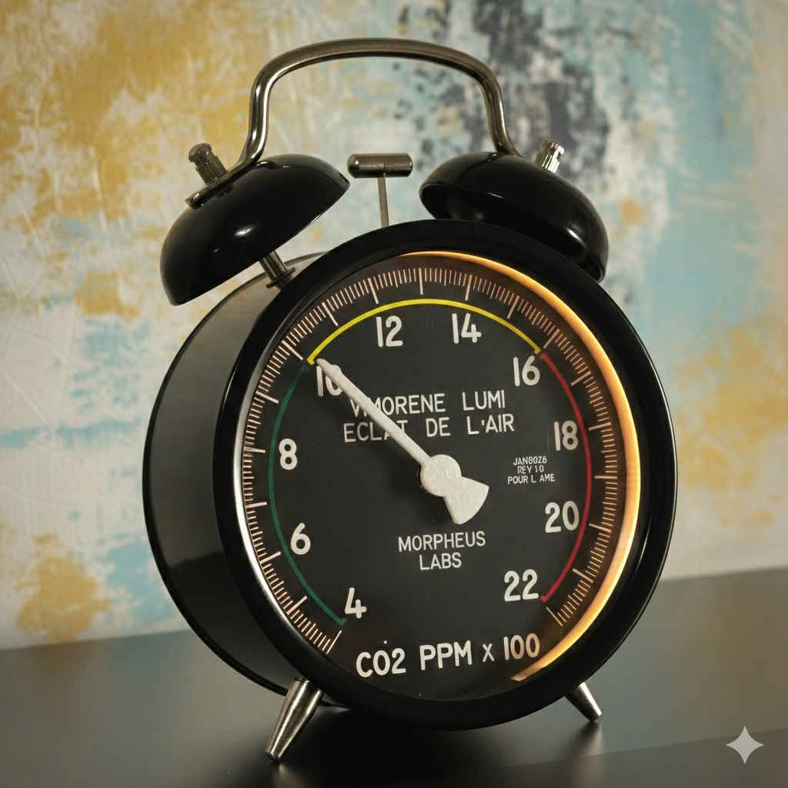

# Vimorene-Lumi

  
Привет! Это мой проект хобби — индикатор концентрации углекислого газа (CO₂) в помещении. Я спроектировал и изготовил устройство самостоятельно, и надеюсь, оно будет полезно для контроля качества воздуха дома или в офисе.

  

   
   

  <h2>Описание</h2>
  
Контроль уровня CO₂ помогает дышать полной грудью, сохранять бодрость и концентрацию. Обычно для комфортного пребывания в помещении уровень CO₂ должен быть в пределах <strong>400–800 ppm</strong> — это свежий и приятный воздух. Если показатели поднимаются выше <strong>800 ppm</strong>, стоит немного проветрить комнату, а при <strong>1200 ppm и выше</strong> воздух уже может вызывать сонливость и снижение работоспособности.

  
На рынке действительно точных CO₂ индикаторов немного, и многие устройства лишь косвенно оценивают воздух. В этом проекте используется настоящий швейцарский датчик <strong>SenseAir S8</strong>, который обеспечивает корректные и стабильные измерения.

  <h2>Особенности устройства</h2>
  <ul>
    <li><strong>Корпус:</strong> Будильник IKEA</li>
    <li><strong>Привод стрелки:</strong> Спидометр от автомобиля Hummer H2</li>
    <li><strong>Регулировка яркости:</strong> Кнопка на задней крышке позволяет выбрать комфортную яркость подсветки</li>
    <li><strong>Передача данных:</strong> Можно передавать данные в интернет и смотреть график изменений CO₂ в браузере</li>
    <li><strong>Эстетика и инженерия:</strong> Устройство объединяет инженерные решения с необычным дизайном</li>
  </ul>

  <h2>Технологии и навыки</h2>
  <ul>
    <li>Программирование на <strong>C++</strong></li>
    <li>Проектирование и изготовление плат в <strong>EasyEDA</strong></li>
    <li><strong>3D-моделирование</strong> в <strong>SolidWorks</strong></li>
    <li><strong>3D-печать различными пластиками</strong> на моём новом 3D-принтере <strong>BamBuLab</strong>, специально купленном для этого проекта</li>
  </ul>

  <h2>Сборка и использование</h2>
  <ol>
    <li>Соберите устройство согласно схеме (платы, датчик SenseAir S8, привод стрелки).</li>
    <li>Загрузите прошивку на Arduino/ESP.</li>
    <li>Настройте яркость подсветки с помощью кнопки на задней крышке.</li>
    <li>При желании подключите к интернету для отображения графика изменений CO₂.</li>
  </ol>

  <h2>Репозиторий</h2>
  
В репозитории содержатся:

  <ul>
    <li>Исходный код прошивки</li>
    <li>3D-модели корпуса и деталей</li>
    <li>Схемы печатных плат</li>
    <li>Инструкции по сборке и подключению</li>
  </ul>

   Для настройки WiFi смотрите [INSTRUCTION_WiFi.md](INSTRUCTION_WiFi.md) 

</body>
</html>
